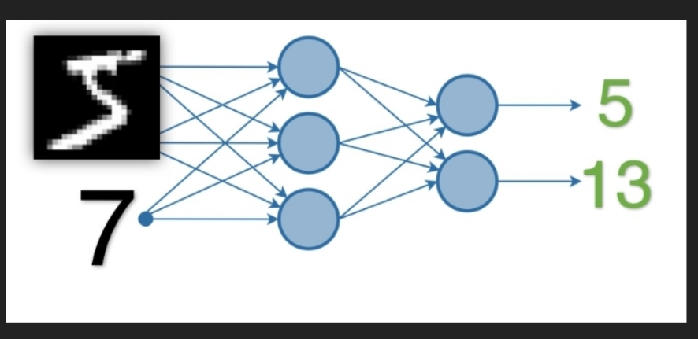
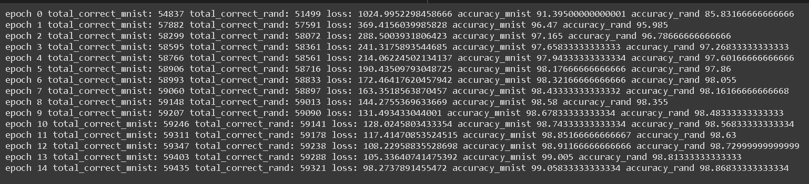
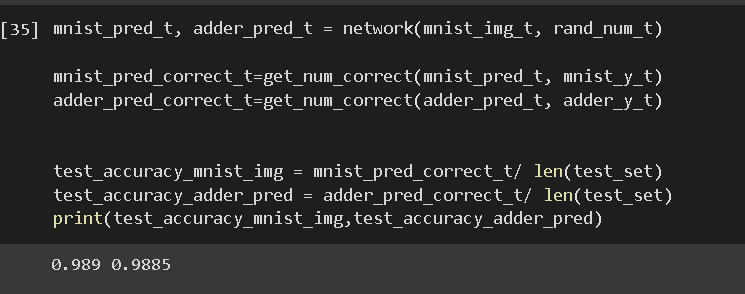

# END2_session3

# Building a neural network which does the following

- Does image classification on MNIST data set
- Takes a random integer ( between 0 and 9) as input and provides 
another output with sum of random number and MNIST label

# My neural network structure 

    - Defined 2 network structures
        - 1 for pure MNIST image classification
        - 1 which takes MNIST network, appends the random 
          number input and outputs the sum

# Process steps 

    - Explained in the notebook with detailed comments
        - How randomd number data is generated and appended
        - Convolution and Dense layers
        - Simple accuracy metric
        - Loss function - cross entropy for both cases

# Run logs

    - Train

    - Test

